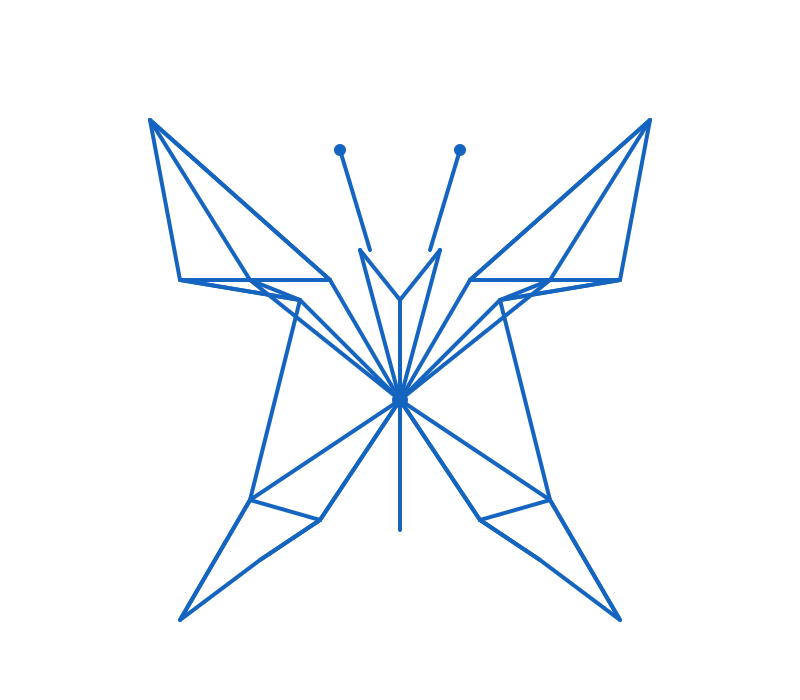

<div align="center">


### Butterfly Effect: Multi-Key FHE from Ring-LWR
#    


*A butterfly flaps its wings; a rounding operation propagates in the multikey FHE setting *

</div>

This repository contains the research implementation accompanying our paper.
It provides two constructions of MKFHE built over the Ring-LWR assumption,
along with a parameter-selection tool that jointly optimises circuit depth
and lattice security using the lattice-estimator.


---

## Overview

Existing MKFHE constructions predominantly rely on Ring-LWE.  This work
shows how to build efficient MKFHE from the Ring-LWR assumption,
which provides smaller public keys and avoids the need to sample discrete
Gaussian errors.  We give:

- **Construction 1** — lifts the LWR-based single-key FHE of
   (ePrint 2024/960) to the multi-key setting.
- **Construction 2** — lifts our own LWR-based single-key FHE to the
  multi-key setting; achieves tighter noise growth under identical
  parameters.
- **Parameter selection** — closed-form noise-growth bounds (derived in
  the paper) are fed into the lattice-estimator to find, for each
  (N, k) pair, the largest circuit depth that is simultaneously correct
  and λ-bit secure.

---

## Repository layout

```
rlwr_mkfhe/
├── poly_utils.py       Ring arithmetic: reduction, rounding, FFT-based poly-mul
├── parameters.py       Security oracle, param search
├── construction1.py    MKFHE_Construction1 class
├── construction2.py    MKFHE_Construction2 class
├── benchmark.py        Circuit-depth benchmarks matching the paper's tables
├── error.py            Noise bounds (log-domain) for the three constructions
├── helper.py           Some helper functions
├── estimator           The lattice estimator from (https://github.com/malb/lattice-estimator)
└── README.md

```

---

## Requirements
The experiments were written based on Python 3.10.12 with dependency of the following packages 

| Package           | Purpose                                    | Version tested |
|-------------------|--------------------------------------------|----------------|
| numpy             | Polynomial coefficient arrays              | ≥ 1.24         |
| scipy             | FFT-based polynomial multiplication        | ≥ 1.11         |
| lattice-estimator | Concrete security estimation               | commit `434f89` |

Install the first two via pip:

```bash
pip install numpy scipy
```

 The lattice estimator from [here](https://github.com/malb/lattice-estimator) is used to esitmate the parameter security.  

---

## Quick start

### Construction 1 — one encrypt-multiply-decrypt round

```python
from construction1 import MKFHE_Construction1
import numpy as np

# Paper parameters for N = 2^13, k = 2
scheme = MKFHE_Construction1(
    N  = 2**13,
    r  = 2**206,
    q  = 2**202,
    p  = 2**198,
    t  = 3,
)

k_parties = 2
sk_list, pk_list = scheme.keygen_multiparty(k_parties)
epk  = scheme.key_extension(pk_list)
rkey = scheme.relinkey_gen_multiparty(sk_list)

msg1 = scheme.random_message()
msg2 = scheme.random_message()
ct1  = scheme.encrypt(msg1, epk)
ct2  = scheme.encrypt(msg2, epk)

# Homomorphic multiplication
ct_mul  = scheme.multiply(ct1, ct2, rkey)

# Threshold decryption (all parties participate)
from poly_utils import poly_mul
expected = poly_mul(msg1, msg2, scheme.N) % scheme.t
result   = scheme.decrypt(sk_list, ct_mul)

assert np.array_equal(result, expected), "Decryption failed!"
print("Multiplication correct ✓")
```

### Construction 2 — same workflow, different modulus chain

```python
from construction2 import MKFHE_Construction2

scheme = MKFHE_Construction2(
    N  = 2**13,
    q  = 2**209,
    p1 = 2**205,
    p2 = 2**201,
    t  = 3,
)

# Key generation, encryption, multiplication, decryption
# similar as before by replacing Construction 1 by Construction 2.
```

### Parameter selection

```python
from parameters import select_parameters, SchemeID

# Find best parameters for Construction 2 over N ∈ {2^13, 2^14, 2^15}
# and k ∈ {2, 4, 8} parties at 128-bit security.
results = select_parameters(
    scheme_id    = SchemeID.LWR_OURS,
    log_n_range  = range(13, 16),
    k_values     = [2, 4, 8],
    target_level = 128,
    verbose      = True,
)

for (log_n, k), params in results.items():
    print(params)
```

### Running the benchmark

```bash
# Construction 1, k = 2 parties, 10 trials per parameter set
python benchmark.py --construction 1 --k 2 --attempts 10

# Construction 2, k = 4 parties, 5 trials
python benchmark.py --construction 2 --k 4 --attempts 5
```

The benchmark prints the achieved circuit depth for each trial alongside the
theoretically predicted depth, making it straightforward to verify the circuit depths
for the parameters given in the paper.


